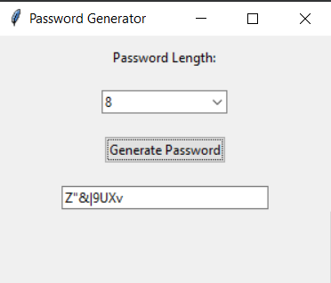

# Password Generator with Tkinter

## Overview
This repository contains a simple, yet effective, password generator developed using Python's `tkinter` library. The application provides an easy-to-use graphical interface that lets users select their desired password length and instantly get a randomized password.

  <!-- You can add a screenshot of your app here -->

## Features
- User-friendly GUI.
- Password length selection (ranging from 6 to 20 characters).
- Generated passwords include a mix of letters (both uppercase and lowercase), numbers, and punctuation.

## How to Run
1. Ensure you have Python installed on your system.
2. Clone the repository:

# Clone the repository

git clone https://github.com/your_username/password-generator-tkinter.git

# 3. Navigate to the cloned directory:

cd Password_Generator

# 4. Run the application:

python password_generator_matinmollapur.py

## Contribution
Feel free to fork the repository and submit pull requests! We're open to any enhancements or bug fixes you have to offer.

